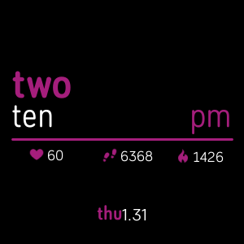
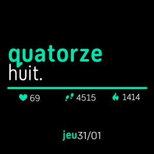
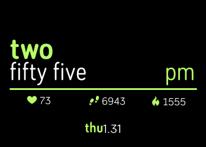
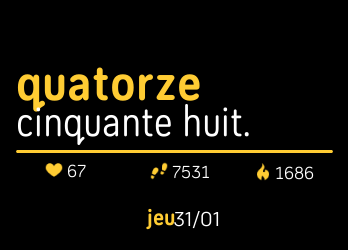
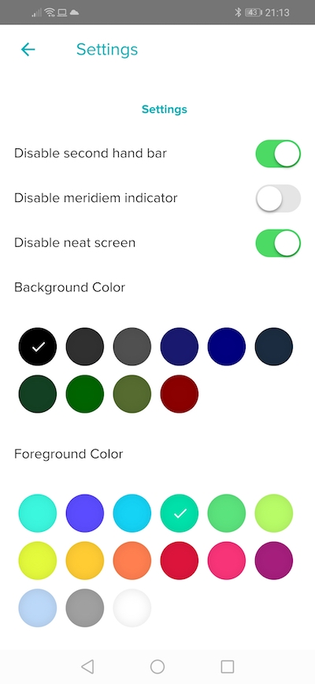
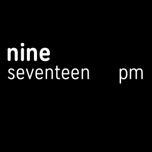

# Fitbit Face Digitless

A Fitbit clock face inspired by vurggodzns' [digitless](https://www.facer.io/watchface/kKMuqp1O4v).

🇬🇧 🇫🇷 [](https://travis-ci.org/FabienM/fitbit-face-digitless)

##### Versa




##### Ionic




##### Settings



## License

Source code is GPLv3.

Design is exclusive property of [vurggodzns](https://www.facer.io/user/XLR9AscBPt).

## Features

##### Second-hand bar

The middle bar grows with seconds from the middle of the screen.

##### Neat first screen

If activated, only the hours appear in a white font at screen wake-up.
Middle bar, colors, indicators and date reveal on user "click".



##### Customizable colors

Background and text colors are customizables.

## Future enhancements

##### Better fonts

While the original design has pretty nice fonts, this version sticks to the defaults FitbitOS fonts, with a disappointing feeling.

##### Customizable indicators

As of today, the heartrates, steps and calories indicators are hard-coded in this order.

More indicators could be supported and reordering could be permitted.

##### More languages

At the time being, only english and french are supported. More languages should come.

## How to build

Prerequisites: Node.js 8.x+

```
git clone https://github.com/FabienM/fitbit-face-digitless.git
cd fitbit-face-digitless
npm install
npm run-script build
```

You can read Fitbit's [CLI Reference](https://dev.fitbit.com/build/guides/command-line-interface/#building-and-installing-your-project)
to learn how to build and deploy this face to your device. 